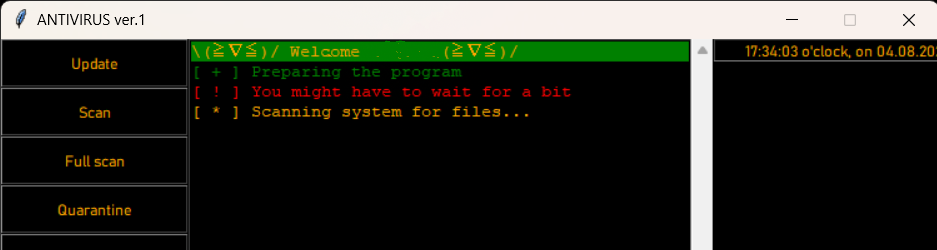
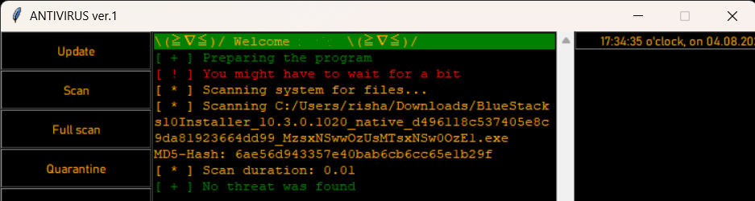
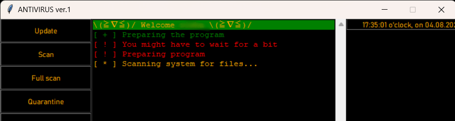
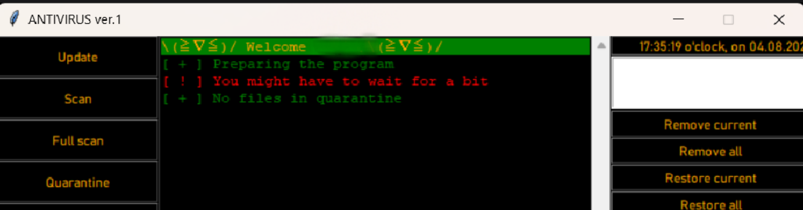

## project Antivirus

### Overview

It is an ambitious antivirus project that seeks to fortify your digital fortress against the relentless onslaught of cyber threats. At this stage, we are tirelessly developing an unbreachable shield to protect your digital world from the forces of malware, viruses, and other sinister online hazards.

### Features

✨ **File Scanning**:  It offers comprehensive file scanning, allowing you to inspect individual files for any hidden threats before opening them.

✨ **System Scan**: For a complete system-wide check, utilize the powerful System Scan feature to detect and remove malicious elements lurking in your computer.

✨ **File Quarantine**: Whenit  detects a lurking danger, it swiftly isolates the threat in its impenetrable quarantine zone, safeguarding your data from harm.

### Usage

Using CyberShield: Aegis is as easy as breathing. Once installed, you can:

1. **Scan On-Demand**: Launch scans of specific files or perform a thorough system-wide scan at your convenience.   
2. **Real-time Protection**: Relish in the peace of mind knowing CyberShield: Aegis stands guard continuously.  
3. **Manage Quarantine**: Check the quarantine area for captured threats and decide their fate.  

### Join the Legion of Protectors

CyberShield: Aegis is an open-source project that welcomes contributions from cybersecurity enthusiasts like yourself. Together, we can fortify the world against digital threats. Interested in joining forces? See [our contributing guidelines](CONTRIBUTING.md) to become part of the legion!

### License

The CyberShield: Aegis Antivirus is currently under the [CyberShield Open License](LICENSE.md), enabling users to protect their systems freely. However, redistribution and commercial use are currently restricted until we finalize the license details.

### Get in Touch!

We'd love to hear from you! If you have suggestions, feedback, or want to collaborate, drop us an email at feedback@cybershield.com or visit our website at [www.cybershield.com](https://cybershield.com).

---
As we forge ahead in the development journey of CyberShield: Aegis, we anticipate incorporating more exciting features and enhancing our user interface. Stay tuned for updates and witness the evolution of cybersecurity in action! Together, we shall conquer the digital realm and shield it from all that threatens its security. 🛡️💻
